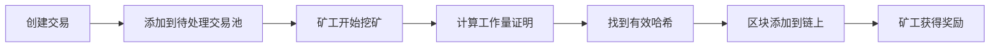

# NodeChain

一个用 Node.js 实现的简单区块链，包含完整的区块链核心功能。

## 功能特性

- ✅ **区块链基础结构** - 创世区块、区块链接
- ✅ **工作量证明 (Proof of Work)** - SHA-256 哈希挖矿
- ✅ **交易系统** - 转账、余额查询
- ✅ **挖矿奖励** - 矿工激励机制
- ✅ **链验证** - 完整性验证、篡改检测
- ✅ **余额管理** - UTXO 模型的简化版

## 项目结构

```
nodechain/
├── src/
│   ├── block.js         # 区块类
│   ├── transaction.js   # 交易类
│   ├── blockchain.js    # 区块链类
│   ├── index.js         # 主程序(演示)
│   └── test.js          # 测试文件
├── package.json
└── README.md
```

## 快速开始

### 1. 安装依赖

```bash
cd nodechain
npm install
```

### 2. 启动 API 服务器 (推荐)

```bash
npm run server
```

这将启动 HTTP API 服务器，监听在 `http://localhost:3000`

可以使用前端区块链浏览器连接到这个服务器查看区块链数据。

### 3. 运行演示

```bash
npm start
```

这将运行一个完整的区块链演示，包括：
- 创建区块链
- 挖矿获得奖励
- 转账交易
- 余额查询
- 区块链验证
- 篡改检测

### 4. 运行测试

```bash
npm test
```

## 核心概念

### 1. 区块 (Block)

每个区块包含：
- `timestamp` - 时间戳
- `transactions` - 交易列表
- `previousHash` - 前一个区块的哈希
- `hash` - 当前区块的哈希
- `nonce` - 工作量证明的随机数

```javascript
{
  timestamp: 1234567890,
  transactions: [...],
  previousHash: "0000abc...",
  hash: "0000def...",
  nonce: 12345
}
```

### 2. 工作量证明 (Proof of Work)

挖矿过程需要找到一个 `nonce` 值，使得区块的哈希值以指定数量的 `0` 开头。

```javascript
// 难度为 4 时，哈希值必须以 "0000" 开头
hash: "0000a1b2c3d4..."
```

**难度设置：**
- 当前难度: `4` (4个前导零)
- 难度越高，挖矿时间越长
- 可在 `blockchain.js` 中调整 `this.difficulty`

### 3. 交易 (Transaction)

每笔交易包含：
- `fromAddress` - 发送方地址
- `toAddress` - 接收方地址
- `amount` - 转账金额
- `timestamp` - 交易时间

```javascript
const tx = new Transaction('alice', 'bob', 50);
```

### 4. 区块链验证

验证包括：
1. ✅ 每个区块的哈希值正确性
2. ✅ 区块之间的链接完整性
3. ✅ 工作量证明的有效性
4. ✅ 所有交易的有效性

## API 使用示例

### 创建区块链

```javascript
import { Blockchain } from './src/blockchain.js';
import { Transaction } from './src/transaction.js';

const blockchain = new Blockchain();
```

### 创建交易

```javascript
const tx = new Transaction('alice', 'bob', 50);
blockchain.addTransaction(tx);
```

### 挖矿

```javascript
blockchain.minePendingTransactions('miner-address');
```

### 查询余额

```javascript
const balance = blockchain.getBalanceOfAddress('alice');
console.log(`Alice 的余额: ${balance}`);
```

### 验证区块链

```javascript
const isValid = blockchain.isChainValid();
console.log(`区块链是否有效: ${isValid}`);
```

### 获取区块链信息

```javascript
const info = blockchain.getChainInfo();
console.log(info);
// {
//   chainLength: 5,
//   difficulty: 4,
//   miningReward: 100,
//   pendingTransactions: 2,
//   isValid: true
// }
```

## 工作流程



## 演示场景

运行 `npm start` 后会看到以下演示：

1. **场景 1**: 矿工首次挖矿，获得奖励
2. **场景 2**: 矿工转账给 Alice
3. **场景 3**: Alice 转账给 Bob
4. **场景 4**: 尝试余额不足的交易(失败)
5. **场景 5**: 篡改区块链并检测

## 技术实现

### 哈希算法

使用 Node.js 内置的 `crypto` 模块，SHA-256 算法：

```javascript
import crypto from 'crypto';

crypto.createHash('sha256')
  .update(data)
  .digest('hex');
```

### 挖矿算法

```javascript
mineBlock(difficulty) {
  const target = Array(difficulty + 1).join('0');

  while (this.hash.substring(0, difficulty) !== target) {
    this.nonce++;
    this.hash = this.calculateHash();
  }
}
```

### 余额计算

遍历所有区块的所有交易，计算某个地址的总收入和总支出：

```javascript
getBalanceOfAddress(address) {
  let balance = 0;

  for (const block of this.chain) {
    for (const trans of block.transactions) {
      if (trans.fromAddress === address) balance -= trans.amount;
      if (trans.toAddress === address) balance += trans.amount;
    }
  }

  return balance;
}
```

## 安全特性

1. **不可篡改性** - 修改历史区块会破坏哈希链接
2. **工作量证明** - 需要计算成本来添加新区块
3. **交易验证** - 余额检查、签名验证(简化版)
4. **链验证** - 完整性检查机制

## 限制与简化

这是一个教学用的简化区块链，与真实区块链的区别：

- ❌ 无网络层(P2P)
- ❌ 无数字签名(使用简单的地址字符串)
- ❌ 无 UTXO 模型(使用账户余额模型)
- ❌ 无共识算法(单节点)
- ❌ 无持久化存储
- ❌ 无 Merkle 树

## 扩展建议

如果想要扩展功能：

1. 添加数字签名(使用椭圆曲线加密)
2. 实现 P2P 网络(使用 WebSocket)
3. 添加智能合约功能
4. 实现数据持久化(SQLite/LevelDB)
5. 添加 Merkle 树优化
6. 实现完整的 UTXO 模型

## 性能说明

- **难度 2**: ~几毫秒
- **难度 3**: ~几十毫秒
- **难度 4**: ~几百毫秒
- **难度 5**: ~几秒
- **难度 6**: ~几十秒

难度每增加 1，平均挖矿时间增加 16 倍(因为每个十六进制位有 16 种可能)。

## 学习资源

- [比特币白皮书](https://bitcoin.org/bitcoin.pdf)
- [以太坊黄皮书](https://ethereum.github.io/yellowpaper/paper.pdf)
- [区块链技术指南](https://yeasy.gitbook.io/blockchain_guide/)

## License

MIT

## 作者

NodeChain - 区块链学习项目
